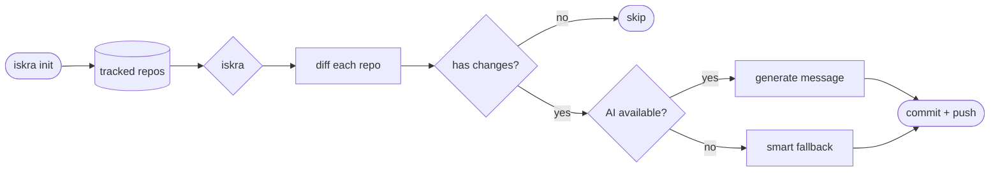
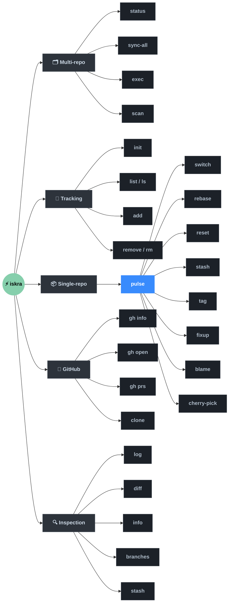

# ⚡ Iskra

<div align="center">


<br><br>

**Git automation for people who manage a lot of repos**

[Install](#installation) · [Quick Start](#quick-start) · [Commands](#commands) · [Configuration](#configuration)

</div>

---

Iskra is a single Go binary that handles the tedious parts of git across all your repositories at once — AI-powered commits, bulk sync, status overview — while also giving you a clean set of single-repo tools under `iskra pulse`.

---

## How it works



---

## Installation

**One-liner** (downloads pre-built binary, no Go required):

```bash
curl -fsSL https://raw.githubusercontent.com/NoamFav/Iskra/main/script/install.sh | bash
```

**From source** (requires Go 1.24+):
```bash
git clone https://github.com/NoamFav/Iskra
cd Iskra && make install
```

**Manual** — grab a tarball from [Releases](https://github.com/NoamFav/Iskra/releases), extract, and move `iskra` to somewhere on your `$PATH`.

### Dependencies

| Tool | Required for |
|------|-------------|
| `git` | Everything |
| `ollama` | AI commit messages (default provider) |
| `gh` | `iskra gh`, `iskra clone` |

---

## Quick Start

```bash
iskra init        # 1. scan a directory and track all repos found
iskra status      # 2. see what's going on across all of them
iskra             # 3. commit and push everything
```

Iskra remembers your repos in `~/.config/iskra/repos.json` and processes them every time you run `iskra`.

---

## Commands



### Multi-repo

```bash
iskra                        # Commit + push all repos (AI messages)
iskra status                 # Status overview across all repos
iskra sync-all               # Pull all tracked repos
iskra exec "git fetch --all" # Run any command across all repos
iskra scan [dir]             # Scan directory, show found repos
```

### Repo tracking

```bash
iskra init [dir]    # Scan a directory and track all found git repos
iskra list          # List tracked repos  (alias: iskra ls)
iskra add [path]    # Add a repo to tracking
iskra remove [path] # Remove a repo  (alias: iskra rm)
```

### Single-repo — `iskra pulse`

`pulse` with no subcommand commits + pushes the **current** repo only.

```bash
iskra pulse                  # Commit + push current repo
iskra pulse -m "fix: typo"   # With manual message
iskra pulse --no-push        # Commit only
iskra pulse --pull           # Pull first, then commit + push
iskra pulse --dry-run        # Preview, no changes
```

<details>
<summary><b>pulse subcommands</b></summary>

```bash
iskra pulse reset [file]                 # Discard changes (staged, unstaged, or hard reset)
iskra pulse switch [branch]             # Interactive branch picker / create / delete
iskra pulse rebase [base]               # Guided rebase with conflict recovery hints
iskra pulse cherry-pick [hash]          # Pick commits with interactive log view
iskra pulse tag [name]                  # Create, list, delete, push tags
iskra pulse fixup [hash]                # Squash staged changes into a past commit
iskra pulse blame <file>                # Per-line author view with color-coded authors
iskra pulse filter --remove-path <path> # Rewrite history (wraps git-filter-repo)
```

</details>

### GitHub integration

> Requires the [`gh`](https://cli.github.com/) CLI.

```bash
iskra gh info           # Repo stats, stars, watchers, open issues
iskra gh open           # Open repo in browser
iskra gh prs            # List open pull requests
iskra gh prs --open 42  # Open PR #42 in browser

iskra clone [dir]                        # Bulk-clone all your GitHub repos
iskra clone --filter-forks --only-stars 5
```

### Inspection

```bash
iskra log       # Pretty git log for current repo
iskra diff      # Colored diff
iskra info      # Rich repo stats (language breakdown, recent commits, upstream)
iskra branches  # List all branches  (alias: iskra br)
iskra stash     # Stash management (list / push / pop)
```

---

## Flags

| Flag | Description |
|------|-------------|
| `--dry-run` | Preview — no changes made |
| `--no-ai-commit` | Skip AI, prompt for message |
| `-m "message"` | Use this commit message |
| `--pull` | Pull before committing |
| `--no-push` | Commit but don't push |
| `--only a,b` | Filter to specific repos by name |
| `--json` | Output JSON |
| `--minimal` | No colors or icons (good for CI) |
| `-q` | Quiet mode |

---

## Configuration

Config lives at `~/.config/iskra/config.yaml`. Created automatically on first run.

```yaml
# Where to scan for repos during `iskra init`
base_dir: ~/code
max_depth: 3

# Git behaviour
auto_pull: true
auto_push: true
default_branch: main
protected_branches: [main, master, production]

# AI commits
use_ai_commit: true
commit_message_style: conventional   # or: simple
ai_provider: ollama                  # or: openai, claude

# Ollama (default — runs locally, free)
ollama_url: http://127.0.0.1:11434
ollama_model: mistral

# OpenAI (set OPENAI_API_KEY env var or add key here)
# ai_provider: openai
# openai_model: gpt-4o-mini

# Claude (set ANTHROPIC_API_KEY env var or add key here)
# ai_provider: claude
# claude_model: claude-opus-4-5

# Safety
require_confirmation: true
dry_run: false
```

### Per-repo overrides

Drop a `.iskra.yaml` in any repo root to override global settings for that repo:

```yaml
auto_push: false
use_ai_commit: false
protected_branches: [main, develop, staging]
```

---

## AI Commit Messages

Iskra generates [Conventional Commits](https://www.conventionalcommits.org/) from your diff:

```
feat(auth): add OAuth2 login flow
fix(api): handle nil pointer in user handler
docs: update installation instructions
refactor(db): simplify query builder
```

| Provider | Setup |
|----------|-------|
| **Ollama** (default, local) | `brew install ollama && ollama pull mistral` |
| **OpenAI** | `export OPENAI_API_KEY=sk-...` |
| **Claude** | `export ANTHROPIC_API_KEY=sk-ant-...` |

If AI generation fails for any reason, Iskra falls back to a smart conventional message generated from the diff — it never blocks you.

---

## Building from Source

```bash
git clone https://github.com/NoamFav/Iskra
cd Iskra

make build      # → bin/iskra
make install    # build + copy to ~/.local/bin/iskra
make lint       # go vet ./...
```

The version string is injected from the git tag at build time via `-ldflags "-X main.version=..."`.

---

## Contributing

1. Fork → branch → commit (use `iskra pulse` 😄)
2. Code is pure Go in `go-core/`. Follow standard Go conventions (`gofmt`, `go vet`).
3. PRs welcome — check [open issues](https://github.com/NoamFav/Iskra/issues) for ideas.

---

## Acknowledgements

- [onefetch](https://github.com/o2sh/onefetch) — inspiration for `iskra info`
- [Lip Gloss](https://github.com/charmbracelet/lipgloss) — terminal styling
- [Ollama](https://ollama.ai) — local AI runtime
- [gh](https://cli.github.com/) — GitHub CLI integration

---

## License

Apache 2.0 — see [LICENSE](LICENSE).

---

<div align="center">
Made with ⚡ by <a href="https://github.com/NoamFav">NoamFav</a>
</div>
