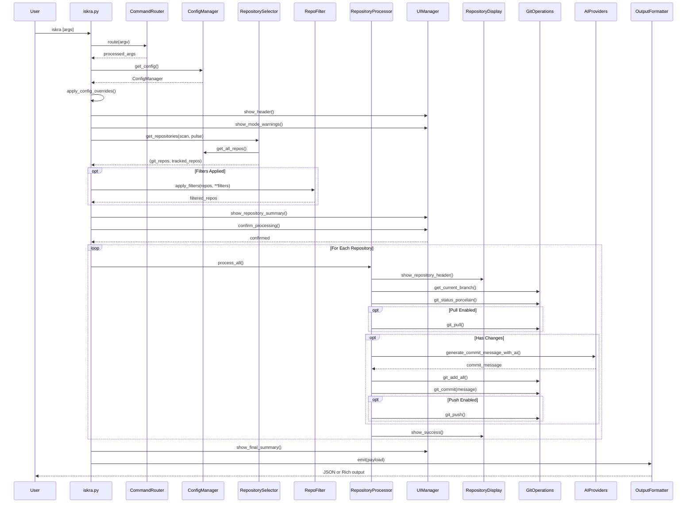
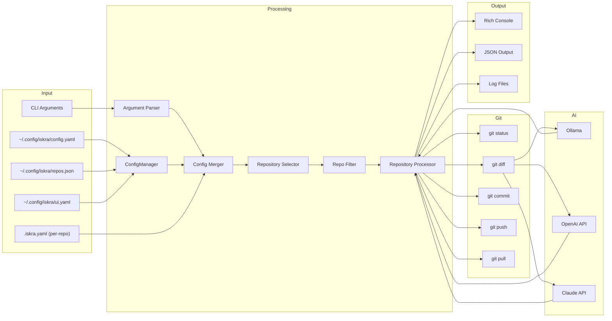

# Iskra Architecture - UML Diagrams

## Class Diagram

```mermaid
classDiagram
    direction TB

    %% ==================== CONFIGURATION LAYER ====================
    class RepoInfo {
        <<dataclass>>
        +path: str
        +name: str
        +remote_url: Optional~str~
        +default_branch: Optional~str~
        +last_commit: Optional~str~
        +last_updated: Optional~str~
        +active: bool
        +to_dict() Dict
        +from_dict(data) RepoInfo$
    }

    class Theme {
        <<dataclass>>
        +theme: str
        +icons_enabled: bool
        +colors: Optional~dict~
        +to_dict() Dict
        +from_dict(data) Theme$
    }

    class GlobalConfig {
        <<dataclass>>
        +base_dir: str
        +config_dir: str
        +max_depth: int
        +follow_symlinks: bool
        +exclude_patterns: List~str~
        +only_patterns: List~str~
        +default_branch: str
        +protected_branches: List~str~
        +auto_pull: bool
        +auto_push: bool
        +auto_stash: bool
        +use_ai_commit: bool
        +ai_provider: str
        +require_confirmation: bool
        +dry_run: bool
        +to_dict() Dict
        +from_dict(data) GlobalConfig$
    }

    class RepoConfig {
        <<dataclass>>
        +protected_branches: Optional~List~
        +use_ai_commit: Optional~bool~
        +auto_pull: Optional~bool~
        +auto_push: Optional~bool~
        +pre_commit_command: Optional~str~
        +post_commit_command: Optional~str~
        +to_dict() Dict
        +from_dict(data) RepoConfig$
    }

    class ConfigManager {
        +config_dir: Path
        +config_file: Path
        +repos_file: Path
        +logs_dir: Path
        +ui_file: Path
        +global_config: GlobalConfig
        +tracked_repos: Dict~str,RepoInfo~
        +ui_config: Theme
        +__init__(config_dir)
        +add_repo(repo_info) bool
        +remove_repo(path) bool
        +get_repo(path) Optional~RepoInfo~
        +get_all_repos(active_only) List~RepoInfo~
        +update_repo(path, **kwargs) bool
        +load_repo_config(repo_path) Optional~RepoConfig~
        +merge_config(repo_path) GlobalConfig
        +get_log_file(name) Path
        +save_global_config(config) void
        +load_ui_config() Theme
    }

    ConfigManager --> GlobalConfig : has
    ConfigManager --> RepoInfo : manages
    ConfigManager --> Theme : has
    ConfigManager ..> RepoConfig : loads

    %% ==================== CORE PROCESSING ====================
    class ProcessingStats {
        <<dataclass>>
        +success_count: int
        +clean_count: int
        +dirty_count: int
    }

    class RepoFilter {
        <<static>>
        +has_changes(repo_path)$ bool
        +behind_remote(repo_path)$ bool
        +ahead_remote(repo_path)$ bool
        +on_branch(repo_path, pattern)$ bool
        +is_dirty(repo_path)$ bool
        +is_clean(repo_path)$ bool
        +has_conflicts(repo_path)$ bool
        +apply_filters(repos, **filters)$ List~str~
    }

    class RepositorySelector {
        -config_manager: ConfigManager
        -config: GlobalConfig
        -base_dir: str
        +__init__(config_manager, config, base_dir)
        +get_repositories(scan, pulse) tuple
        -_get_pulse_repo() List~tuple~
        -_scan_repositories() List~tuple~
        -_get_tracked_repositories() List~tuple~
        -_should_include_repo(repo_name) bool
    }

    class RepositoryProcessor {
        -config_manager: ConfigManager
        -orig_cwd: str
        -console: Console
        +__init__(config_manager, orig_cwd, console)
        +process_all(git_repos, args, tracked_repos, rich_enabled) tuple
        -_process_single_repo(repo_path, display_name, args, tracked_repos) RepoResult
        -_has_changes(repo_path) bool
        -_create_repo_args(config, args_orig, repo_path) RepoArgs
        -_update_tracked_repo(repo_path) void
    }

    class CommandRouter {
        <<static>>
        +COMMAND_MAPPINGS: dict$
        +KNOWN_COMMANDS: list$
        +route(argv)$ List~str~
        +show_unknown_command_error(cmd)$ void
    }

    class UIManager {
        -rich_enabled: bool
        -console: Console
        +__init__(rich_enabled, console)
        +show_header() void
        +show_mode_warnings(args) void
        +show_repository_summary(repo_count, message) void
        +confirm_processing(repo_count) bool
        +show_final_summary(args, stats, total) void
    }

    class AIConfig {
        <<dataclass>>
        +provider: str
        +openai_api_key: Optional~str~
        +openai_model: str
        +claude_api_key: Optional~str~
        +claude_model: str
    }

    RepositorySelector --> ConfigManager : uses
    RepositoryProcessor --> ConfigManager : uses
    RepositoryProcessor --> ProcessingStats : updates
    RepositoryProcessor ..> RepoFilter : uses

    %% ==================== UI LAYER ====================
    class RepositoryState {
        <<dataclass>>
        +path: str
        +name: str
        +branch: str
        +is_clean: bool
        +status_output: str
        +changes_count: int
        +has_changes: bool
    }

    class ProcessingResult {
        <<dataclass>>
        +success: bool
        +elapsed_time: float
    }

    class RepositoryDisplay {
        -console: Console
        +__init__(console)
        +show_minimal_clean(name, branch) void
        +show_repository_header(state, path) void
        +show_branch_info(branch) void
        +show_clean_status() void
        +show_changes_tree(status_output) void
        +show_commit_panel(commit_output, is_ai) void
        +show_ai_commit_thinking(changes_count) void
        +show_push_result(push_output) void
        +show_elapsed_time(elapsed) void
        +show_success(name) void
        +show_error(name, error) void
    }

    class GitOperationsHandler {
        -display: RepositoryDisplay
        +__init__(display)
        +pull_changes(args) tuple
        +handle_file_cleanup(args, table) bool
        +commit_with_ai(msg, count, provider, config) tuple
        +commit_standard(commit_message) str
        +push_if_enabled(args) Optional~str~
    }

    class UIRepositoryProcessor {
        <<ui/display.py>>
        -display: RepositoryDisplay
        -ops_handler: GitOperationsHandler
        +__init__()
        +process(entry_path, entry, args, task_id, progress, orig_cwd) bool
        -_check_ssh_keys() void
        -_show_diff() void
        -_get_repository_state(path, name) RepositoryState
        -_handle_pull(args, state, table) RepositoryState
        -_get_commit_message(args, status_output) str
    }

    GitOperationsHandler --> RepositoryDisplay : uses
    UIRepositoryProcessor --> RepositoryDisplay : has
    UIRepositoryProcessor --> GitOperationsHandler : has
    UIRepositoryProcessor --> RepositoryState : creates

    %% ==================== OUTPUT LAYER ====================
    class RepoChanges {
        <<dataclass>>
        +uncommitted: int
        +staged: int
        +untracked: int
    }

    class RepoRemote {
        <<dataclass>>
        +ahead: int
        +behind: int
        +url: str
    }

    class RepoCommit {
        <<dataclass>>
        +hash: str
        +message: str
        +author: str
        +timestamp: str
    }

    class RepoResult {
        <<dataclass>>
        +path: str
        +name: str
        +status: RepoStatusType
        +branch: str
        +changes: RepoChanges
        +remote: RepoRemote
        +commit: RepoCommit
        +error: Optional~str~
        +to_dict() Dict
    }

    class OutputPayload {
        <<dataclass>>
        +success: bool
        +operation: OperationType
        +repos_total: int
        +repos_success: int
        +repos_failed: int
        +results: List~RepoResult~
        +errors: List~str~
        +timestamp: str
        +to_dict() Dict
    }

    class BaseFormatter {
        <<abstract>>
        +emit(payload)* void
    }

    class JSONFormatter {
        -console: Console
        +__init__(console)
        +emit(payload) void
    }

    class ConsoleFormatter {
        -console: Console
        +__init__(console)
        +emit(payload) void
    }

    RepoResult --> RepoChanges : has
    RepoResult --> RepoRemote : has
    RepoResult --> RepoCommit : has
    OutputPayload --> RepoResult : contains
    BaseFormatter <|-- JSONFormatter : extends
    BaseFormatter <|-- ConsoleFormatter : extends

    %% ==================== API LAYER ====================
    class ChangesSummary {
        <<dataclass>>
        +uncommitted: int
        +staged: int
        +untracked: int
        +modified_files: List~str~
        +has_changes: bool
    }

    class RemoteStatus {
        <<dataclass>>
        +url: str
        +ahead: int
        +behind: int
        +in_sync: bool
    }

    class CommitInfo {
        <<dataclass>>
        +hash: str
        +message: str
        +author: str
        +timestamp: str
    }

    class RepoStatus {
        <<dataclass>>
        +path: str
        +name: str
        +branch: str
        +changes: ChangesSummary
        +remote: RemoteStatus
        +last_commit: CommitInfo
        +is_valid_repo: bool
        +errors: List~str~
    }

    class ProcessResult {
        <<dataclass>>
        +success: bool
        +repo_path: str
        +operations: List~Operation~
        +errors: List~str~
        +duration: float
    }

    class BatchResult {
        <<dataclass>>
        +total: int
        +successful: int
        +failed: int
        +results: List~ProcessResult~
    }

    class IskraManager {
        -config_manager: ConfigManager
        +__init__(config_path)
        +get_all_repos(active_only) List~RepoInfo~
        +get_repo_status(repo_path) RepoStatus
        +filter_repos(**filters) List~RepoInfo~
        +process_repo(repo_path, **opts) ProcessResult
        +process_all(**opts) BatchResult
        +pull_repo(repo_path) ProcessResult
        +commit_repo(repo_path, message) ProcessResult
        +push_repo(repo_path) ProcessResult
        +add_repo(repo_path, **kwargs) bool
        +remove_repo(repo_path) bool
        +validate_repo(repo_path) ValidationResult
    }

    IskraManager --> ConfigManager : uses
    IskraManager ..> RepoStatus : returns
    IskraManager ..> ProcessResult : returns
    IskraManager ..> BatchResult : returns
    RepoStatus --> ChangesSummary : has
    RepoStatus --> RemoteStatus : has
    RepoStatus --> CommitInfo : has

    %% ==================== GITHUB LAYER ====================
    class APICache {
        <<singleton>>
        -_cache: dict$
        -_enabled: bool$
        +get(key)$ Any
        +set(key, value)$ void
        +get_or_fetch(key, fetcher)$ T
        +clear()$ void
        +disable()$ void
        +enable()$ void
        +is_cached(key)$ bool
    }

    %% ==================== MAIN ENTRY POINTS ====================
    class IskraMain {
        <<iskra.py>>
        +main(argv) void
        +build_repo_filters(args) Dict
        +create_argument_parser() ArgumentParser
        +apply_config_overrides(config, args) void
        +write_log_entry(...) void
    }

    IskraMain --> CommandRouter : uses
    IskraMain --> ConfigManager : uses
    IskraMain --> RepositorySelector : uses
    IskraMain --> RepositoryProcessor : uses
    IskraMain --> UIManager : uses
    IskraMain --> RepoFilter : uses
    IskraMain ..> OutputPayload : creates
    IskraMain --> BaseFormatter : uses
```

## Component Diagram

```mermaid
flowchart TB
    subgraph CLI["CLI Entry Points"]
        iskra["iskra (main)"]
        init["iskra init"]
        exec["iskra exec"]
        clone["iskra clone"]
        gh["iskra gh"]
        log["iskra log"]
        info["iskra info"]
    end

    subgraph Core["Core Layer"]
        CommandRouter
        RepositorySelector
        RepositoryProcessor
        RepoFilter
        GitOperations["git_operations.py"]
        RepoScanner["repo_scanner.py"]
        AIProviders["ai_providers.py"]
    end

    subgraph Config["Configuration"]
        ConfigManager
        GlobalConfig
        RepoInfo
        Theme
    end

    subgraph UI["UI Layer"]
        UIManager
        RepositoryDisplay
        GitOperationsHandler
        Formatting["formatting.py"]
        Tables["tables.py"]
    end

    subgraph Output["Output Layer"]
        OutputPayload
        JSONFormatter
        ConsoleFormatter
    end

    subgraph API["Public API"]
        IskraManager
    end

    subgraph GitHub["GitHub Integration"]
        APICache
        GitHubAPI["api.py"]
        CloneHelper["clone.py"]
    end

    %% CLI connections
    iskra --> CommandRouter
    iskra --> RepositorySelector
    iskra --> RepositoryProcessor
    iskra --> UIManager
    init --> ConfigManager
    clone --> GitHubAPI
    clone --> CloneHelper
    gh --> GitHubAPI

    %% Core connections
    CommandRouter --> iskra
    CommandRouter --> init
    CommandRouter --> exec
    CommandRouter --> clone
    CommandRouter --> gh
    CommandRouter --> log
    CommandRouter --> info

    RepositorySelector --> ConfigManager
    RepositorySelector --> RepoScanner
    RepositoryProcessor --> ConfigManager
    RepositoryProcessor --> GitOperations
    RepositoryProcessor --> AIProviders

    %% UI connections
    RepositoryDisplay --> Formatting
    GitOperationsHandler --> GitOperations
    GitOperationsHandler --> AIProviders
    UIManager --> Formatting

    %% Output connections
    iskra --> JSONFormatter
    iskra --> ConsoleFormatter

    %% API connections
    IskraManager --> ConfigManager
    IskraManager --> GitOperations

    %% GitHub connections
    GitHubAPI --> APICache
```

## Sequence Diagram - Main Processing Flow

```mermaid
sequenceDiagram
    participant User
    participant CLI as iskra.py
    participant CR as CommandRouter
    participant CM as ConfigManager
    participant RS as RepositorySelector
    participant RF as RepoFilter
    participant RP as RepositoryProcessor
    participant UI as UIManager
    participant RD as RepositoryDisplay
    participant GO as GitOperations
    participant AI as AIProviders
    participant OF as OutputFormatter

    User->>CLI: iskra [args]
    CLI->>CR: route(argv)
    CR-->>CLI: processed_args

    CLI->>CM: get_config()
    CM-->>CLI: ConfigManager

    CLI->>CLI: apply_config_overrides()

    CLI->>UI: show_header()
    CLI->>UI: show_mode_warnings()

    CLI->>RS: get_repositories(scan, pulse)
    RS->>CM: get_all_repos()
    RS-->>CLI: (git_repos, tracked_repos)

    opt Filters Applied
        CLI->>RF: apply_filters(repos, **filters)
        RF-->>CLI: filtered_repos
    end

    CLI->>UI: show_repository_summary()
    CLI->>UI: confirm_processing()
    UI-->>CLI: confirmed

    loop For Each Repository
        CLI->>RP: process_all()
        RP->>RD: show_repository_header()
        RP->>GO: get_current_branch()
        RP->>GO: git_status_porcelain()

        opt Pull Enabled
            RP->>GO: git_pull()
        end

        opt Has Changes
            RP->>AI: generate_commit_message_with_ai()
            AI-->>RP: commit_message
            RP->>GO: git_add_all()
            RP->>GO: git_commit(message)

            opt Push Enabled
                RP->>GO: git_push()
            end
        end

        RP->>RD: show_success()
    end

    CLI->>UI: show_final_summary()
    CLI->>OF: emit(payload)
    OF-->>User: JSON or Rich output
```

## Data Flow Diagram

```mermaid
flowchart LR
    subgraph Input
        CLI_Args["CLI Arguments"]
        ConfigFile["~/.config/iskra/config.yaml"]
        ReposFile["~/.config/iskra/repos.json"]
        UIFile["~/.config/iskra/ui.yaml"]
        RepoConfig[".iskra.yaml (per-repo)"]
    end

    subgraph Processing
        ArgParser["Argument Parser"]
        ConfigMgr["ConfigManager"]
        Merger["Config Merger"]
        Selector["Repository Selector"]
        Filter["Repo Filter"]
        Processor["Repository Processor"]
    end

    subgraph Git
        GitStatus["git status"]
        GitDiff["git diff"]
        GitCommit["git commit"]
        GitPush["git push"]
        GitPull["git pull"]
    end

    subgraph AI
        Ollama["Ollama"]
        OpenAI["OpenAI API"]
        Claude["Claude API"]
    end

    subgraph Output
        RichUI["Rich Console"]
        JSONOut["JSON Output"]
        LogFile["Log Files"]
    end

    CLI_Args --> ArgParser
    ConfigFile --> ConfigMgr
    ReposFile --> ConfigMgr
    UIFile --> ConfigMgr

    ArgParser --> Merger
    ConfigMgr --> Merger
    RepoConfig --> Merger

    Merger --> Selector
    Selector --> Filter
    Filter --> Processor

    Processor --> GitStatus
    Processor --> GitDiff
    GitDiff --> Ollama
    GitDiff --> OpenAI
    GitDiff --> Claude

    Ollama --> Processor
    OpenAI --> Processor
    Claude --> Processor

    Processor --> GitCommit
    Processor --> GitPush
    Processor --> GitPull

    Processor --> RichUI
    Processor --> JSONOut
    Processor --> LogFile
```

## Module Dependencies

```mermaid
flowchart TB
    subgraph Entry["Entry Points"]
        iskra_py["iskra.py"]
        init_py["init.py"]
        exec_py["exec.py"]
        clone_py["clone_repos.py"]
        gh_py["gh.py"]
        log_py["log.py"]
        info_py["info.py"]
    end

    subgraph Core["core/"]
        command_router["command_router.py"]
        repository_selector["repository_selector.py"]
        repository_processor["repository_processor.py"]
        filters["filters.py"]
        git_operations["git_operations.py"]
        repo_scanner["repo_scanner.py"]
        ai_providers["ai_providers.py"]
        ui_manager["ui_manager.py"]
        processing_stats["processing_stats.py"]
        constants["constants.py"]
    end

    subgraph UI["ui/"]
        formatting["formatting.py"]
        display["display.py"]
        tables["tables.py"]
    end

    subgraph OutputMod["output/"]
        formatter["formatter.py"]
    end

    subgraph GitHub["github/"]
        api["api.py"]
        cache["cache.py"]
        clone["clone.py"]
    end

    subgraph Config["config"]
        config["config.py"]
    end

    subgraph API["api/"]
        manager["manager.py"]
    end

    %% Entry point dependencies
    iskra_py --> command_router
    iskra_py --> config
    iskra_py --> repository_selector
    iskra_py --> repository_processor
    iskra_py --> ui_manager
    iskra_py --> filters
    iskra_py --> formatting
    iskra_py --> formatter

    init_py --> config
    init_py --> formatting
    init_py --> formatter
    init_py --> repo_scanner

    clone_py --> api
    clone_py --> clone
    clone_py --> formatting
    clone_py --> formatter

    gh_py --> api
    gh_py --> formatting
    gh_py --> git_operations

    %% Core dependencies
    repository_selector --> config
    repository_selector --> repo_scanner

    repository_processor --> config
    repository_processor --> display
    repository_processor --> processing_stats
    repository_processor --> formatter

    ui_manager --> formatting

    display --> formatting
    display --> git_operations
    display --> ai_providers

    ai_providers --> config

    %% UI dependencies
    formatting --> constants
    formatting --> config

    %% Output dependencies
    formatter --> formatting

    %% GitHub dependencies
    api --> cache
    api --> formatting
    clone --> repo_scanner
    clone --> formatting

    %% API dependencies
    manager --> config
    manager --> git_operations
```
