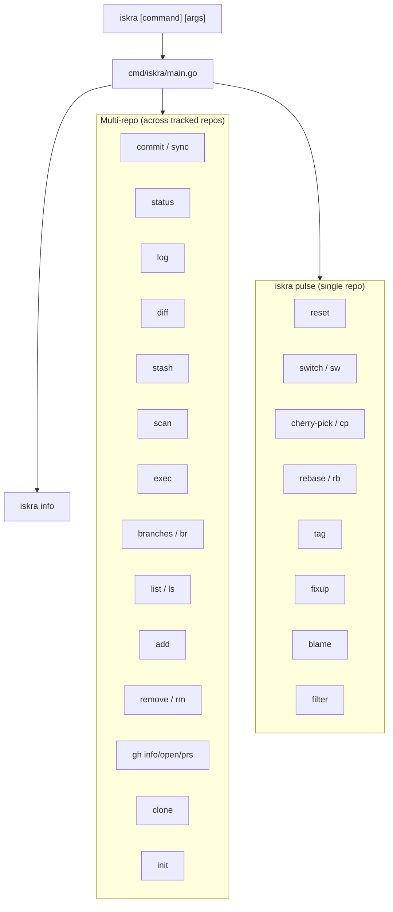
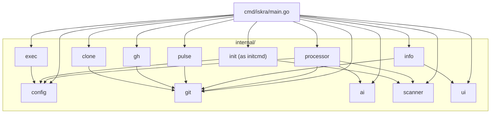
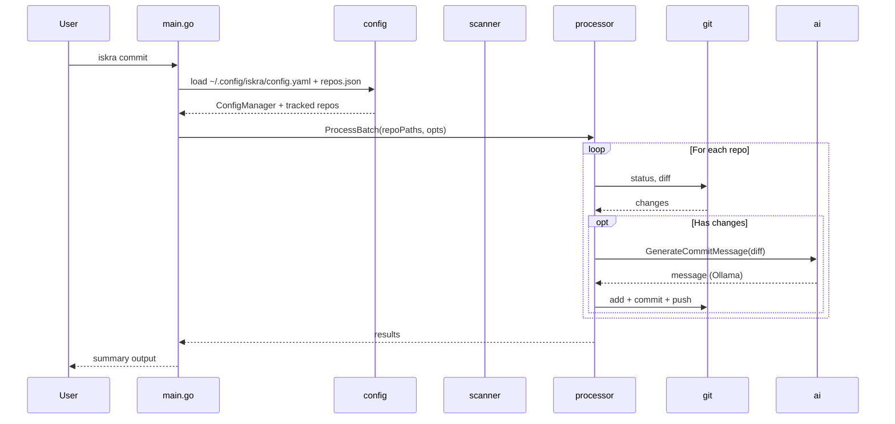
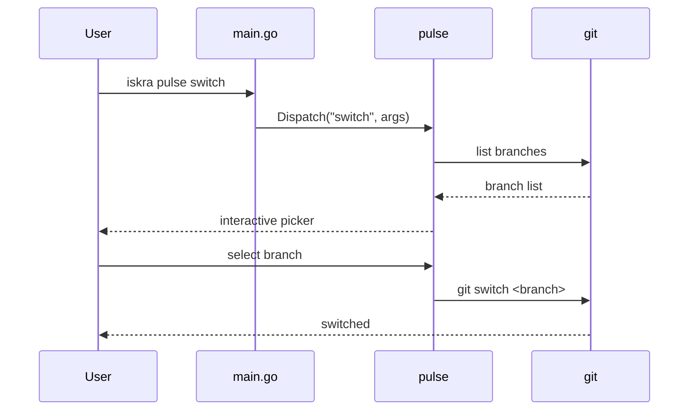
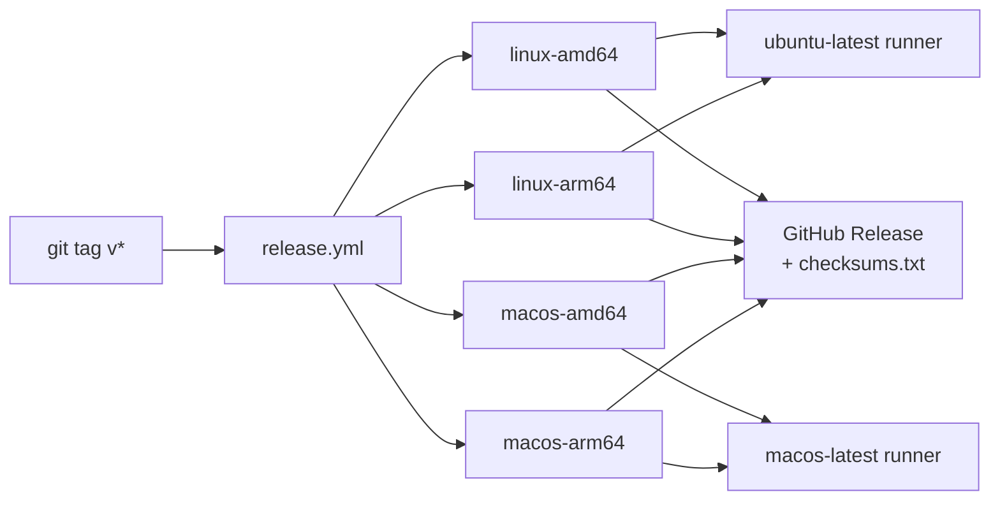

# Iskra Architecture

## Overview

Iskra is a pure Go CLI tool for multi-repository Git management. A single binary handles all commands. There is no Python, no subprocesses, no JSON bridge.

```
iskra/
├── go-core/
│   ├── cmd/iskra/main.go       # CLI entry point & command routing
│   └── internal/
│       ├── config/             # Config + repo tracking
│       ├── git/                # Low-level git helpers
│       ├── ai/                 # Ollama integration
│       ├── processor/          # Batch repo processing
│       ├── scanner/            # Git repo discovery
│       ├── info/               # `iskra info` rendering
│       ├── pulse/              # `iskra pulse` subcommands
│       ├── gh/                 # GitHub CLI wrapper
│       ├── clone/              # Bulk repo cloning
│       ├── init/               # `iskra init` setup
│       ├── exec/               # `iskra exec` cross-repo execution
│       └── ui/                 # Lip Gloss styles & output helpers
├── script/install.sh           # Installer (download-first, source fallback)
├── Makefile                    # Dev targets: build/install/lint/release-local
└── .github/workflows/
    ├── ci.yml                  # go vet + build + smoke test on push/PR
    └── release.yml             # 4-platform binary release on v* tag
```

---

## Command Routing



---

## Package Diagram



---

## Data Flow — Multi-repo Operation



---

## Data Flow — `iskra pulse` Operation



---

## `iskra info` Rendering

```mermaid
flowchart LR
    subgraph info["internal/info/"]
        infoGo["info.go\nfetch data"]
        displayGo["display.go\nrender output"]
        asciiGo["ascii.go\nASCII art"]
    end

    infoGo -->|RepoInfo struct| displayGo
    asciiGo -->|art lines| displayGo

    infoGo --> git["git helpers"]
    infoGo --> gh["gh CLI\n(open PRs)"]

    displayGo -->|visibleLen()| terminal["Terminal output\nANSI-aware borders"]
```

`display.go` uses `visibleLen()` to strip ANSI escape sequences before computing column widths, ensuring borders align correctly regardless of color codes.

---

## Config Files

| File | Purpose |
|------|---------|
| `~/.config/iskra/config.yaml` | Global config (base dir, AI provider, depth, patterns) |
| `~/.config/iskra/repos.json` | Tracked repository list |

---

## Build & Release



Version string is injected at build time:
```
go build -ldflags "-X main.version=$(git describe --tags --always)"
```

---

## Key Design Decisions

- **`internal/init` → imported as `initcmd`** — avoids collision with Go's `init()` builtin
- **`iskra` = multi-repo, `iskra pulse` = single-repo** — clean namespace separation
- **Lip Gloss for styling** — terminal UI only; Bubble Tea is reserved for Zvezda (TUI companion)
- **Ollama as default AI provider** — local-first, no API key required
- **`gh` CLI as GitHub integration layer** — no direct GitHub API calls from Iskra
